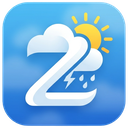
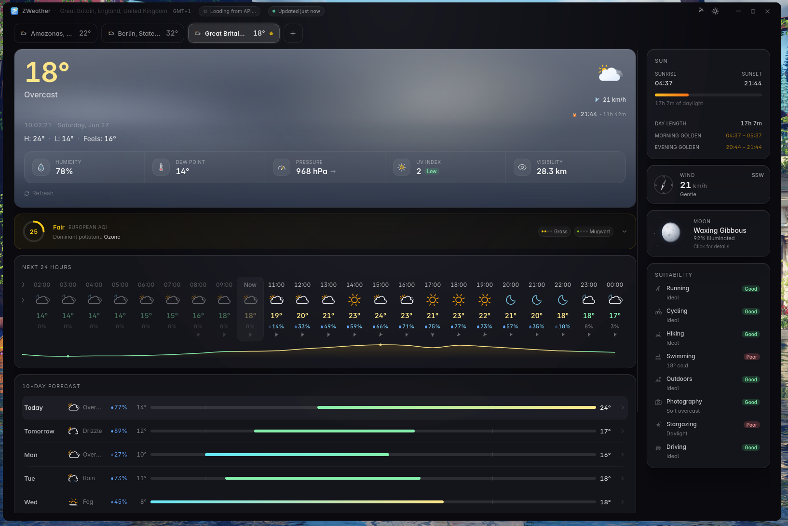
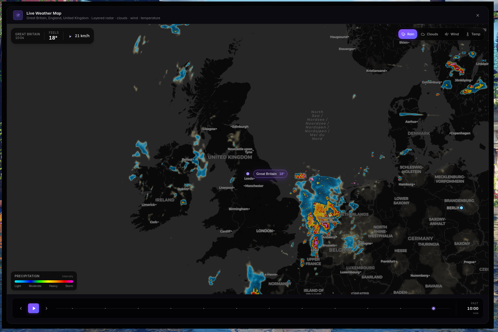
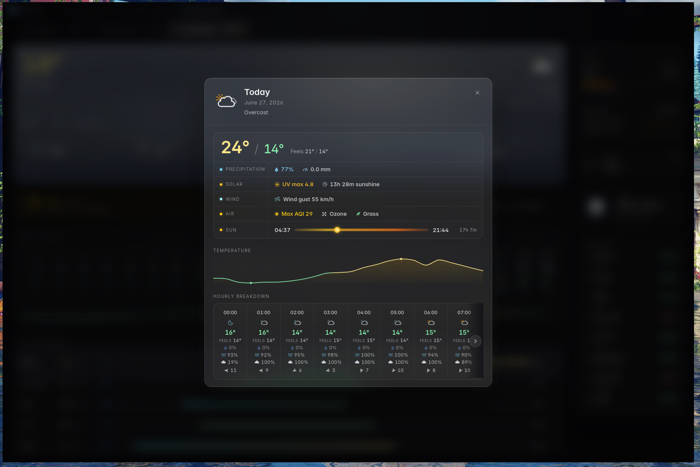
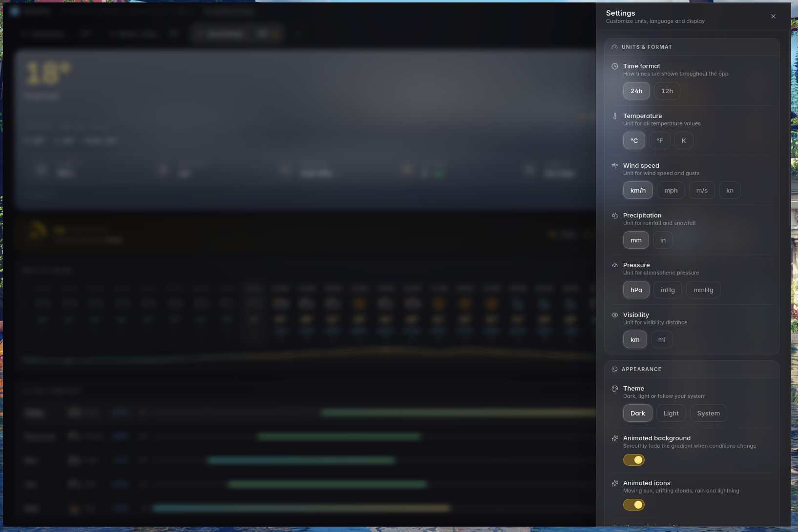
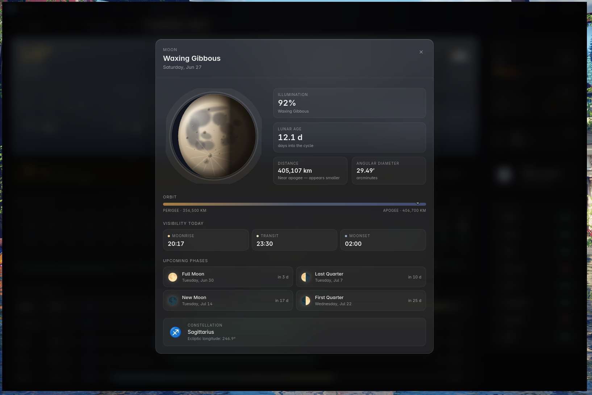
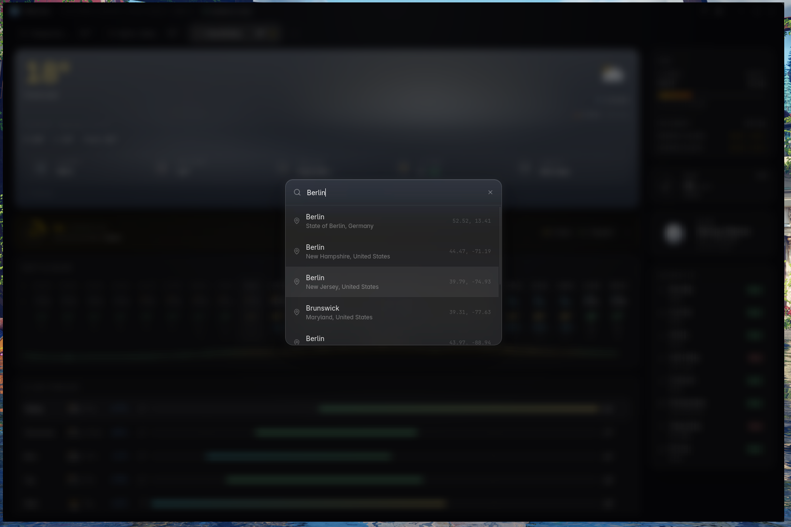

<h1>ZWeather</h1>

<b>A native desktop weather app.</b> 
No account. No telemetry. No cloud sync.

  
  
  
  
   
  
  
  
  

  Animated radar &middot; Severe-weather alerts (US + EU) &middot; Air quality &middot; 10-day forecast &middot; Multi-location

  <a href="#screenshots">Screenshots</a> &nbsp;·&nbsp;
  <a href="#features">Features</a> &nbsp;·&nbsp;
  <a href="#radar-map">Radar</a> &nbsp;·&nbsp;
  <a href="#sun--moon">Sun &amp; Moon</a> &nbsp;·&nbsp;
  <a href="#keyboard-shortcuts">Shortcuts</a> &nbsp;·&nbsp;
  <a href="#data-sources">Data sources</a> &nbsp;·&nbsp;
  <a href="#privacy">Privacy</a>

---

## Screenshots

<table>
<tr>
  <td align="center" width="50%">
    
     <b>Main dashboard</b> hero · 24 h strip · 10-day list · right rail
  </td>
  <td align="center" width="50%">
    
     <b>Radar map</b> precipitation · clouds · wind · temperature
  </td>
</tr>
<tr>
  <td align="center">
    
     <b>Per-day detail</b> hourly curves · AQI · overlapping alerts
  </td>
  <td align="center">
    
     <b>Settings</b> units · appearance · notifications · refresh · tray
  </td>
</tr>
<tr>
  <td align="center">
    
     <b>Moon detail</b> phase · illumination · rise &amp; set times
  </td>
  <td align="center">
    
     <b>Location search</b> find any city by name
  </td>
</tr>
</table>

---

## Features

### 🌡️ Current conditions

<table>
<tr><td>

- Hero temperature with a weather-driven icon
- Feels-like temperature &amp; today's high / low
- Humidity, dew point, pressure (with **rising / falling / steady** trend arrow)
- Colour-coded UV index pill
- Wind speed, direction, and a dedicated compass card

</td><td>

- Live clock and date rendered in the **active location's** timezone *(not your machine's)*
- Next sun event (sunrise or sunset) with a countdown
- Morning &amp; evening **golden-hour windows**
- Visibility · pressure trend · dew point inline

</td></tr>
</table>

### 📅 Forecasts

- **Next 24 hours** — horizontal scroll strip with a temperature sparkline, hover for per-hour values
- **10-day** daily list — high / low, precipitation %, condition icon
- **Per-day detail modal** — hourly temperature curve, hour-by-hour breakdown (feels-like, humidity, cloud cover, wind, precipitation), UV max, peak wind gust, sunshine duration, a sun arc with day length, a day-level AQI tile and any alerts overlapping that day

### 🍃 Air quality &amp; pollen

<table>
<tr>
  <th align="left">European AQI · US AQI</th>
  <th align="left">Auto-routed by country</th>
</tr>
<tr>
  <td><b>Pollutants</b></td>
  <td>PM2.5 · PM10 · Ozone · NO₂ · SO₂ · CO · Dust</td>
</tr>
<tr>
  <td><b>Pollen</b></td>
  <td>Alder · Birch · Grass · Mugwort · Olive · Ragweed</td>
</tr>
<tr>
  <td><b>Trends</b></td>
  <td>5-day hourly history in the expandable drawer</td>
</tr>
<tr>
  <td><b>Dominant pollutant badge</b></td>
  <td>Surfaced at a glance on the collapsed card</td>
</tr>
</table>

### 🛰️ Radar map

A full-screen map with **four swappable weather layers**:

<table>
<tr>
  <td>🌧️ <b>Precipitation</b></td>
  <td>Animated radar overlay — past 2 hours + 30-minute nowcast — with a timeline scrubber, play/pause and step controls</td>
</tr>
<tr>
  <td>☁️ <b>Clouds</b></td>
  <td>Gridded cloud cover painted as soft tinted blobs</td>
</tr>
<tr>
  <td>💨 <b>Wind</b></td>
  <td>Animated streamline particles flowing along the live wind field, colour-ramped by speed</td>
</tr>
<tr>
  <td>🌡️ <b>Temperature</b></td>
  <td>Bilinear-sampled heatmap with a smooth colour ramp</td>
</tr>
</table>

Move your cursor over the map to **see the value at that point**. Every saved location appears as a labelled pin, with the active one highlighted by a pulsing halo.

### ⚠️ Severe-weather alerts

- 🇺🇸 **US** coverage via [`weather.gov`](https://www.weather.gov/)
- 🇪🇺 **European** coverage via [**MeteoAlarm**](https://meteoalarm.org/) national feeds
- Routed automatically by the active location's coordinates
- Top-of-dashboard banner, severity colour-coded
- Detail modal with full text, affected areas and timestamps in the **location's** timezone
- Alerts overlapping a selected day also surface in the per-day modal

> **Desktop notifications** fire the first time a new alert is seen, with per-severity toggles (**extreme · severe · moderate · minor**) in Settings.

### ☀️ Sun &amp; moon

- Explicit **sunrise &amp; sunset times** with the day-length total
- Daylight progress bar that animates to the elapsed share of the day
- Concrete **golden-hour windows** *(not just a generic countdown)*
- Moon-phase card with illumination percentage

<b>🌙 Click the moon — detailed view</b>

A fully SVG-rendered moon with:

- **Selenographically-placed maria** (Mare Tranquillitatis, Imbrium, Serenitatis, …)
- **23 named craters** at their real coordinates (Tycho, Copernicus, Kepler, Aristarchus, …)
- **Tycho's ray system** painted across the southern highlands
- **Regolith texture**, **terminator** shadow line, **limb darkening** and faint **earthshine** on the unlit side
- Real-time **libration wobble** based on lunar age
- Apparent disc size scales with Earth–Moon distance (1.06× at perigee · 0.94× at apogee)

Plus, in the panel:

- Illumination % · lunar age (days) · Earth–Moon distance with a perigee/apogee orbit bar · angular diameter
- Moonrise · transit · moonset — in **your location's** timezone
- The **next four principal phases** with countdowns
- The current **zodiac constellation** the moon is passing through

### 🚴 Activity suitability

Eight outdoor activities scored **good · fair · poor** with reason chips that explain *why* — `too hot`, `windy`, `golden hour`, `slippery roads`, `ideal`, etc.

<table align="center">
<tr>
  <td align="center">🏃 Running</td>
  <td align="center">🚴 Cycling</td>
  <td align="center">🥾 Hiking</td>
  <td align="center">🏊 Swimming</td>
</tr>
<tr>
  <td align="center">🌳 Outdoors</td>
  <td align="center">📷 Photography</td>
  <td align="center">🔭 Stargazing</td>
  <td align="center">🚗 Driving</td>
</tr>
</table>

> Air quality is factored into outdoor activities: poor AQI downgrades the score and surfaces the air-quality band as the reason.

### 📍 Locations

- Add by city search
- Set primary · remove · right-click for actions
- **Drag-to-reorder** the location strip
- Mouse-wheel scrolls the strip horizontally
- One click switches the active location
- Location names re-localise when you change UI language

### 🟢 Live freshness

A small pill in the title bar shows when the data was last updated. It turns 🟡 **amber** when the feed is stale (older than 2× your refresh interval) and 🔴 **rose** when you go offline.

### 🎨 Weather icons &amp; animation

- Premium icon set with day-and-night variants
- Animated hero motion layers behind the temperature, themed per condition — *clear · partly cloudy · fog · rain · snow · storm · hail · …*
- A condition-tinted gradient over the whole window with a smooth fade between states

<b>Toggle animations off individually</b>

- **Animated icons** — freezes weather icons to a single frame
- **Animated background** — instant swap instead of cross-fade
- **Time-of-day shift** — keep the day palette even at night

### 🖥️ System tray

| | |
|---|---|
| **Tray icon** | Live condition icon and/or temperature for your primary location — configurable in Settings |
| **Tray tooltip** | Location · condition · temperature *(Windows / macOS)* |
| **Left-click** | Compact popover next to the tray icon — current conditions and a 6-hour strip; closes when you click away *(Windows / macOS)* |
| **Right-click** | *Open Dashboard* · *Quit* |
| **Closing the dashboard** | ZWeather keeps running in the tray and the dashboard is fully released, so it uses next to no CPU or memory until you reopen it. Severe-weather notifications keep working. |

### ⚙️ Settings

A slide-out panel with every option you need:

<table>
<tr>
  <td><b>🌐 Languages</b></td>
  <td>🇬🇧 English · 🇩🇪 Deutsch · 🇫🇷 Français · 🇪🇸 Español · 🇮🇹 Italiano</td>
</tr>
<tr>
  <td><b>🌡️ Temperature</b></td>
  <td>°C · °F · K</td>
</tr>
<tr>
  <td><b>💨 Wind</b></td>
  <td>km/h · mph · m/s · knots</td>
</tr>
<tr>
  <td><b>📊 Pressure</b></td>
  <td>hPa · inHg · mmHg</td>
</tr>
<tr>
  <td><b>🌧️ Precipitation</b></td>
  <td>mm · in</td>
</tr>
<tr>
  <td><b>👁️ Visibility</b></td>
  <td>km · mi</td>
</tr>
<tr>
  <td><b>🕐 Time format</b></td>
  <td>24 h · 12 h</td>
</tr>
<tr>
  <td><b>🎨 Theme</b></td>
  <td>dark · light · system</td>
</tr>
<tr>
  <td><b>✨ Animations</b></td>
  <td>icons · background · time-of-day shift</td>
</tr>
<tr>
  <td><b>🔔 Notification thresholds</b></td>
  <td>per alert severity (extreme / severe / moderate / minor)</td>
</tr>
<tr>
  <td><b>🔄 Refresh interval</b></td>
  <td>5 / 10 / 15 / 30 / 60 minutes</td>
</tr>
<tr>
  <td><b>📌 Tray icon style</b></td>
  <td>icon · temperature · both · none</td>
</tr>
<tr>
  <td><b>🧪 Send test notification</b></td>
  <td>Button + live permission status indicator</td>
</tr>
</table>

### 🪟 Window UX

- Borderless window with a custom title bar *(translucent with rounded corners on macOS / Linux, opaque on Windows)*
- **Single instance** — re-launching focuses the existing window
- **Window state remembered** between sessions (size · position)
- First-launch **setup wizard** for time format, units and language

---

## Keyboard shortcuts

<table>
<tr><th>Context</th><th>Key</th><th>Action</th></tr>
<tr><td rowspan="3">Radar map</td>
    <td><kbd>Esc</kbd></td><td>Close radar</td></tr>
<tr><td><kbd>←</kbd> / <kbd>→</kbd></td><td>Step one frame back / forward</td></tr>
<tr><td><kbd>Space</kbd></td><td>Toggle playback</td></tr>
<tr><td>Any modal</td><td><kbd>Esc</kbd></td><td>Dismiss</td></tr>
</table>

---

## Data sources

ZWeather is transparent about every API it touches. **No third-party analytics, no proxies, no aggregators.**

<table>
<tr><th>Provider</th><th>Used for</th><th>Auth required</th></tr>
<tr><td><a href="https://open-meteo.com/">Open-Meteo</a></td><td>Forecast · current conditions · air quality · gridded layers (wind, clouds, temperature)</td><td>No</td></tr>
<tr><td><a href="https://www.rainviewer.com/">RainViewer</a></td><td>Animated precipitation radar tiles</td><td>No</td></tr>
<tr><td><a href="https://www.weather.gov/">weather.gov</a></td><td>US severe-weather alerts</td><td>No</td></tr>
<tr><td><a href="https://meteoalarm.org/">MeteoAlarm</a></td><td>European severe-weather alerts</td><td>No</td></tr>
<tr><td><a href="https://www.geonames.org/">GeoNames</a> / Open-Meteo geocoding</td><td>City search</td><td>No</td></tr>
<tr><td><a href="https://carto.com/">CartoDB</a></td><td>Map base tiles (dark mode)</td><td>No</td></tr>
</table>

---

## Privacy

> 💯 **100 % local.** Nothing leaves your machine except the direct API calls to the weather providers listed above.
>
> No analytics SDK · No crash reporter · No account system · No auto-updater pinging home · No telemetry of any kind.

Your saved locations, settings, and preferences live in your OS's app-data folder — and stay there.

---

## Tech stack

<table>
<tr>
  <td align="center"><b>Shell</b></td>
  <td align="center"><b>Frontend</b></td>
  <td align="center"><b>Native</b></td>
  <td align="center"><b>Data</b></td>
</tr>
<tr>
  <td align="center">
    <a href="https://tauri.app/">Tauri 2</a> 
    3–7 MB native installer
  </td>
  <td align="center">
    React 19 · TypeScript 5.8 
    Tailwind · Framer Motion · Zustand · React Query
  </td>
  <td align="center">
    Rust 
    tray · single-instance · window-state · notifications
  </td>
  <td align="center">
    Open-Meteo · RainViewer 
    weather.gov · MeteoAlarm
  </td>
</tr>
</table>

---

## Download

Prebuilt installers for **Windows, macOS (Intel & Apple Silicon) and Linux** live on the project website:

### → **[zsync.eu/zweather](https://zsync.eu/zweather/)**

The download page hosts every release format — `.exe` / `.msi` (Windows), `.dmg` (macOS Intel & Apple Silicon), `.deb` / `.rpm` / `.AppImage` (Linux) — alongside a `SHA256SUMS.txt` file you can use to verify the integrity of any download. The same files are attached to every [GitHub release](https://github.com/TheHolyOneZ/ZWeather/releases).

| Platform | Requirement |
|---|---|
| Windows | 10 or 11, x64 |
| macOS | 11 Big Sur or newer, Apple Silicon or Intel |
| Linux | x86_64 with glibc 2.35+ — Ubuntu 22.04+, Debian 12+, Fedora 36+ |

What changed in each version: [CHANGELOG.md](CHANGELOG.md).

---

## License

ZWeather is free software, released under the **[GNU General Public License v3.0](LICENSE)**.

You can use, study, share and modify it. If you distribute a modified version, it must remain GPL-3.0 and the source must be made available. See the [`LICENSE`](LICENSE) file for the full text.

---

## Author & links

Made by **[TheHolyOneZ](https://github.com/TheHolyOneZ)**.

- **Source code:** [github.com/TheHolyOneZ/ZWeather](https://github.com/TheHolyOneZ/ZWeather)
- **Downloads / website:** [zsync.eu/zweather](https://zsync.eu/zweather/)
- **More projects:** [zsync.eu](https://zsync.eu)

---

Built on <a href="https://tauri.app/">Tauri 2</a>. Made with care, not telemetry.

